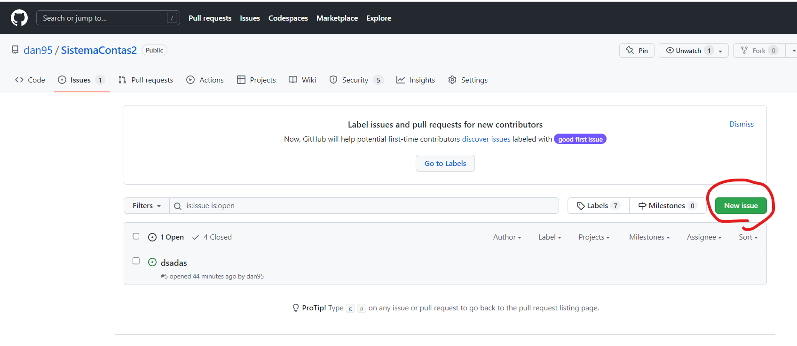

# OctoEvents

## Pre-requisites

- Windows [wsl](https://learn.microsoft.com/en-us/windows/wsl/install)
- Docker Engine (runs along with wsl)
- Docker-compose
- Dotnet [SDK 7](https://dotnet.microsoft.com/en-us/download/dotnet/7.0)
- Dotnet Entity Framework extension (dotnet tool install --global dotnet-ef)
- [Make](https://gnuwin32.sourceforge.net/packages/make.htm) for Windows
---
## How to run:

### Make commands

The "make" command is responsible for running the first task defined in the ./Makefile
```
make
```
Therefore, when running "make", it actually runs the following command:
```
default: init upmigrations
```

This command runs the following pre-set instructions:
```
init:
	powershell -C "wsl docker-compose -f ./docker-compose.yml up --build -d"

clean:
	dotnet clean

upmigrations: clean
	dotnet ef database update --project .\src\Infrastructure\OctoEvents.Infrastructure.Data\OctoEvents.Infrastructure.Data.csproj --startup-project .\src\Services\OctoEvents.API\OctoEvents.API.csproj
```


This command, as it reads, creates the database, besides the database schema.

### Setting up ngrok

By downloading [ngrok](https://bin.equinox.io/c/bNyj1mQVY4c/ngrok-v3-stable-windows-amd64.zip), it's possible to configure it by running the following command:

```
ngrok https https://localhost:7081 
```

---

### Executing application

First, it's necessary to configure the webhooks, as follows:

1)


2)


3)


4)


---

### Creating issue

1)


2)
